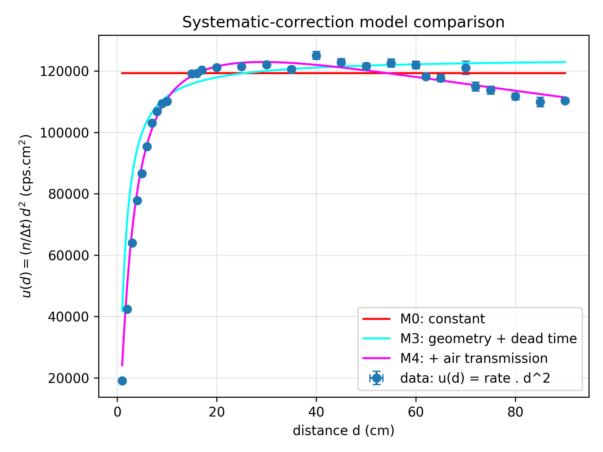
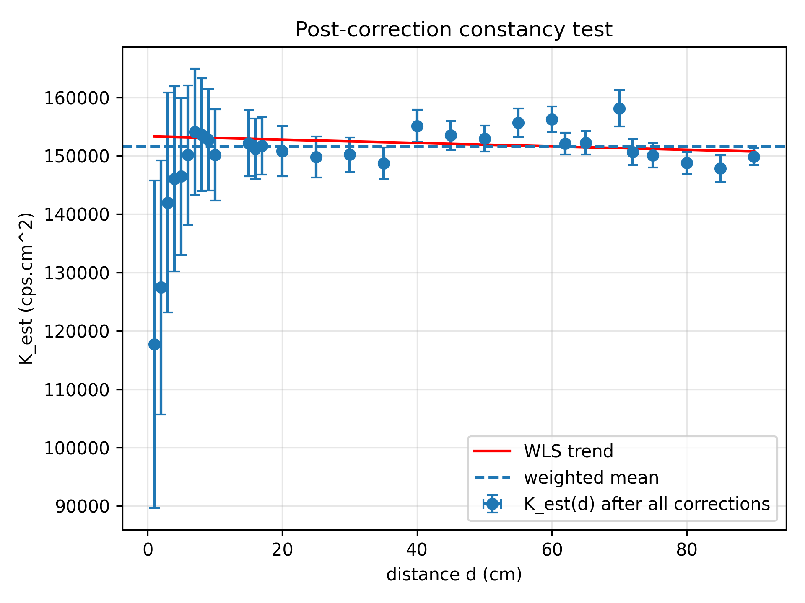

# Radiation

Analysis of a Sr-90 beta source's count rate vs. distance, testing the
inverse-square law and correcting for detector dead time, solid-angle
geometry, and beta attenuation in air.

## Layout

```
radiation/        reusable analysis package (physics models, fitting, I/O)
scripts/          thin CLI entry points that call into radiation/
data/             raw measurements (rate vs. distance, oscilloscope traces)
results/          generated figures and tables, committed (see Notes below)
docs/             lab script and final report PDFs
archive/          original notebooks and first-pass outputs, kept for reference
```

## Setup

```bash
pip install -r requirements.txt
# or: pip install -e .
```

## Usage

```bash
# Fit models M0 (bare inverse-square) through M4 (+ offset, solid angle,
# dead time, air transmission) to rate-vs-distance data, and report the
# fully corrected source constant K_est(d).
python scripts/fit_inverse_square.py --data data/filtered_data.csv

# Standalone cross-check: grid-search the beta-spectrum mixing weight
# against far-field data only.
python scripts/air_transmission_explore.py --data data/filtered_data.csv

# Measure detector dead time from oscilloscope pulse traces.
python scripts/measure_deadtime.py --data-dir data/deadtime
```

Each script prints its results and writes figures/tables under `results/`.

## Physics models

`radiation/models.py` defines five nested models for
`u(d) = rate(d) * d^2`, which should be flat if the inverse-square law and no
systematics held exactly:

- **M0** — constant (far-field only)
- **M1** — + geometric distance offset `d0`
- **M2** — + finite-detector solid angle
- **M3** — + paralyzable dead-time correction
- **M4** — + beta transmission through air (two-endpoint allowed-spectrum
  model for the Sr-90/Y-90 decay chain)

`radiation/fitting.py` fits all five by orthogonal distance regression
(uncertainties in both distance and rate), compares them by AIC/BIC and
nested delta-chi2 tests, and reconstructs the corrected constant `K_est(d)`
with propagated uncertainty, testing it for constancy and residual trend.

## Key results

Dead time, from five oscilloscope pulse traces: **τ = 3.12 ± 0.06 μs**.

Fitting the five nested models to `u(d) = rate(d)·d²` (30 distance points,
0–90 cm), the full model (M4: offset + solid angle + dead time + air
transmission) is overwhelmingly preferred over any model missing the air
term:

| Model | k | χ² | dof | χ²_red |
|---|---|---|---|---|
| M1 + offset | 2 | 1065.7 | 28 | 38.1 |
| M2 + solid angle | 2 | 1035.8 | 28 | 37.0 |
| M3 + dead time | 2 | 990.1 | 28 | 35.4 |
| **M4 + air transmission** | **3** | **67.9** | **27** | **2.52** |

Adding the air-transmission term alone (M3 → M4) drops χ² by 922 for one
extra parameter (p ≈ 1×10⁻²⁰²). The fit gives a geometric offset
`d0 = 1.34 ± 0.08 cm` and an effective low-energy beta-spectrum weight
`f_low = 0.169 ± 0.016`.



Backing out the fully corrected source constant point-by-point and taking
its weighted mean gives **K̄ = 151,580 ± 540 cps·cm²**, consistent with a
constant across the full distance range (χ² = 26.4, dof = 29, p = 0.61) with
no significant residual trend with distance (slope p = 0.25):



With a 1 cm² detector area, this implies `Aη = 4πK̄ ≈ (1.905 ± 0.007)×10⁶ Bq`,
and — relative to the source's labeled 5 MBq activity — an overall detection
efficiency **η ≈ 0.381 ± 0.001**.

Note: even the best model doesn't formally pass a χ² goodness-of-fit test
(χ²_red = 2.52 still gives p ≈ 2×10⁻⁵), meaning some smaller, unmodeled
systematic remains beyond geometry, dead time, and air attenuation — the
corrections applied are real and large, just not quite complete.

## Notes

- `results/` is committed with the current run's figures/tables so the
  analysis is visible without executing anything; rerunning the scripts
  regenerates them in place.
- `archive/` holds the original exploratory notebooks and first-pass dead-time
  outputs the scripts above were distilled from.

## License

MIT — see [LICENSE](LICENSE).
